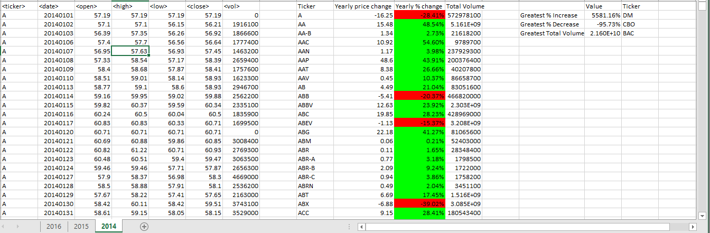

# VBA-challenge
VBA scripting to analyze real stock market data.

In this repository, the folder named [**Resources**](./Resources) contains four files:
  1. [alphabetical_testing.xlsx](./Resources/alphabetical_testing.xlsx)
  2. [alphabetical_testing_GI.xlsm](./Resources/alphabetical_testing_GI.xlsx)
  3. [Multiple_year_stock_data.xlsx](./Resources/Multiple_year_stock_data.xlsx)
  4. [Multiple_year_stock_data_GI.xlsm](./Resources/Multiple_year_stock_data_GI.xlsxm)
  
The files with extension .xlsm contain the macro developed and the data elaboration. [alphabetical_testing_GI](./Resources/alphabetical_testing_GI.xlsx) was the training data set to develop the script while [Multiple_year_stock_data](./Resources/Multiple_year_stock_data_GI.xlsxm) contains real stock market data for the years 2016, 2015 and 2014 as the final version of the macro.
  
The final macro code is reported [here](./Sub_VBA_Stocks.vbs). The script developed is reading and elaborating the data in every worksheet in the workbook. \
The script prints in 4 additional columns the following values for each ticker of the stock: \
    1. writing the *ticker* symbol \
    2. calculate the *yearly change* of the stock \
    3. evaluate the *yearly percent change* of the stock \
    4. obtain the *total volume* of the stock. 
    
The column reporting the *yearly percent change* is subject to conditional formatting and it colors the cell green or red if there is a positive or a negative value for the change, respectively. Additionally, since the percent yearly percent change is evaluated with the following equation: $$\frac{*closing_price*-*opening_price*)}{*opening_price*}$$ the script is controlling if the closing and opening price are both zero the cell value is set to 0 and the color to red. In contrast, if the opening price is zero and the closing price is not, the cell value is set to N/A and the color is set red or green if the closing price is negative or positive, respectively. \
Finally the script is returning the value and the ticker symbol for the greatest % increase, Greatest % descrease and the Greatest total volume.

In the following lines there is a snapshot of the first 25 lines of the excel worksheets:
* year 2014

* year 2015

* year 2016

